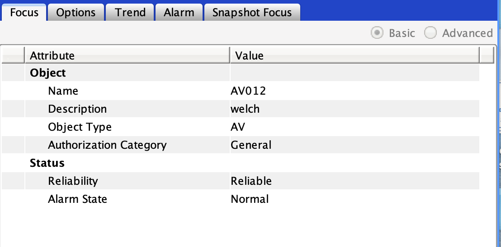
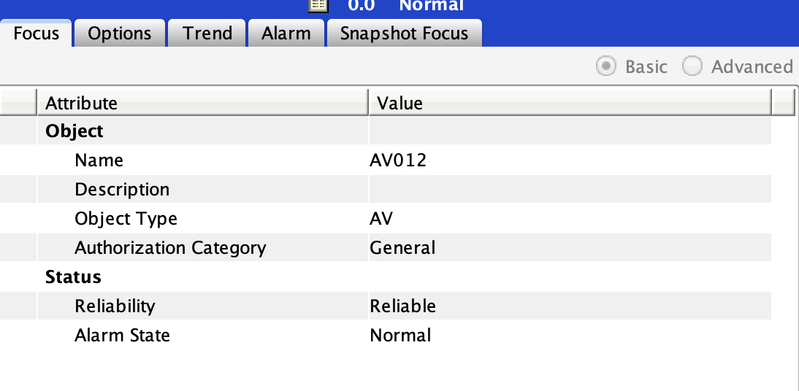

# README

<!-- cspell:ignoreWords Metasys cmdlet MSSDA -->
To use powershell to invoke Metasys web services I recommend the `Invoke-RestMethod` cmdlet as it understands JSON and parses it for you. This makes it much easier to deal with the results.

## Get A Token

First you must acquire a token. You want to protect that token. So we'll invoke the method, retrieve the access token, and store it in a `SecureString` all in one line. (Note: you also want to protect your password but I haven't researched credential stores enough to figure out best way to do that). I did figure out `SecureString` because you need the token in this format to use `Invoke-RestMethod`.

Basically we are doing a `POST` to `/login`:

```powershell
> $json = '{ "username": "yourUserName", "password": "yourPassword" }'
> $secureAccessToken = ConvertTo-SecureString -String (Invoke-RestMethod -Body $json -ContentType "application/json" -Uri https://usa.cg.na.jci.com/api/v3/login -SkipCertificateCheck -Method POST).accessToken -AsPlainText
```

You wouldn't normally want to use `-SkipCertificateCheck` in a production system. But even though SMP thinks the cert if fine, my local computer doesn't trust the cert when using powershell. (I imagine SMP has a local certificate keystore it's checking against?)

## Read an Object

Now you can use the token from the first step on multiple calls to the system. A typical use case is to read an object or the attribute of an object. To do that you need the `id` of the object. This isn't discoverable in the UI (yet). But you can use the `/objectIdentifiers` endpoint to look up the `id` given a reference.

This is a `GET /objectIdentifiers`

```powershell
> $siteId = Invoke-RestMethod -Uri https://usa.cg.na.jci.com/api/v3/objectIdentifiers?fqr=usa:usa -Authentication bearer -Token $secureAccessToken -SkipCertificateCheck -Method GET
```

We can double check this worked:

```powershell
> $siteId
06fa33b0-f717-5f14-b4ef-e592356f4e4c
```

Now I'm going to read the site director object using this id (and then display the result):

This is a `GET /objects/{id}` where `id` is the `$siteId` we just read:

<!-- cspell:disable -->
```powershell
> $siteObject = Invoke-RestMethod -Uri https://usa.cg.na.jci.com/api/v3/objects/$siteId -Authentication bearer -Token $secureAccessToken -SkipCertificateCheck -Method GET
> $siteObject
$siteObject

self                 : https://usa.cg.na.jci.com/api/v3/objects/06fa33b0-f717-5f14-b4ef-e592356f4e4c?i
                       ncludeSchema=false&viewId=viewNameEnumSet.focusView
objectType           : objectTypeEnumSet.adsClass
parentUrl            : https://usa.cg.na.jci.com/api/v3/objects/ac291d17-1a2e-56ae-b6ab-ea4d7daea3f1
objectsUrl           : https://usa.cg.na.jci.com/api/v3/objects/06fa33b0-f717-5f14-b4ef-e592356f4e4c/o
                       bjects
networkDeviceUrl     :
pointsUrl            : https://usa.cg.na.jci.com/api/v3/objects/06fa33b0-f717-5f14-b4ef-e592356f4e4c/p
                       oints
trendedAttributesUrl : https://usa.cg.na.jci.com/api/v3/objects/06fa33b0-f717-5f14-b4ef-e592356f4e4c/t
                       rendedAttributes
alarmsUrl            : https://usa.cg.na.jci.com/api/v3/objects/06fa33b0-f717-5f14-b4ef-e592356f4e4c/a
                       larms
auditsUrl            : https://usa.cg.na.jci.com/api/v3/objects/06fa33b0-f717-5f14-b4ef-e592356f4e4c/a
                       udits
item                 : @{attrChangeCount=0; name=USA; description=;
                       bacnetObjectType=objectTypeEnumSet.adsClass;
                       objectCategory=objectCategoryEnumSet.systemCategory; version=; modelName=ADS;
                       localTime=; localDate=; itemReference=USA:USA;
                       fipsComplianceStatus=noOfComplianceStateEnumSet.nonCompliantUnlicensed;
                       almSnoozeTime=5; auditEnabledClasLev=2; addAdsrepos=System.Object[];
                       adsRepositoriesStatus=System.Object[]; sampleRate=6561.165; serviceTime=1579;
                       numberOfNxesReporting=504; transferBufferFullWorstNxe=65;
                       hostName=SystemSNC-08; isValidated=True;
                       id=06fa33b0-f717-5f14-b4ef-e592356f4e4c}
views                : {@{title=Focus; views=System.Object[]; id=viewNameEnumSet.focusView}}
```
<!-- cspell:enable -->

Note that the more complex values aren't expanded. We can specifically mention one to see it. Let's look at the date and time.

```powershell
> $siteObject.item.localDate

year month dayOfMonth dayOfWeek
---- ----- ---------- ---------
2020     6         27         6

> $siteObject.item.localTime

hour minute second hundredth
---- ------ ------ ---------
  13     46     47       859
```

## More Options with an Object

Now let's see if we can modify an object by writing to it, and by sending a command.

First let's read an object with more interesting commands. Here the fqr for an AV: `USA:alabama.cg.na.jci.com/Programming2.AV012`. We'll do the following

1. Get the id
2. Read the default view
3. List other views
4. Read a different view
5. Read a single attribute
6. Write some attributes
7. List the commands
8. Send a command

For all of the steps that involve reading, the only thing that really changes is the URL. For the steps that involve writing or sending a command we'll also need to include a body.

### Get the id

Again this is `GET /objectIdentifiers`:

```powershell
> $id = Invoke-RestMethod -Uri https://usa.cg.na.jci.com/api/v3/objectIdentifiers?fqr=usa:alabama.cg.na.jci.com/Programming2.AV012 -Authentication bearer -Token $secureAccessToken -SkipCertificateCheck -Method GET
> $id
9c42b998-ba30-5bb2-85ca-5a337ee82818
```

### Read Default View

This is `GET /objects/{id}`:

```powershell
> $av = Invoke-RestMethod -Uri https://usa.cg.na.jci.com/api/v3/objects/$id -Authentication bearer -Token $secureAccessToken -SkipCertificateCheck -Method GET
> $av.item.presentValue
0
> $av.item.description
> $av.item.name
AV012
```

### List the Views

`GET /objects/{id}/views`

Here I'll fetch the views and then show how I explored them to find the options view:

```powershell
> $views = Invoke-RestMethod -Uri https://usa.cg.na.jci.com/api/v3/objects/$id/views -Authentication bearer -Token $secureAccessToken -SkipCertificateCheck -Method GET
> $views.items

id                          viewUrl
--                          -------
viewNameEnumSet.focusView   https://usa.cg.na.jci.com/api/v3/objects/9c42b998-ba30-5bb2-85ca-5a337ee8…
viewNameEnumSet.optionsView https://usa.cg.na.jci.com/api/v3/objects/9c42b998-ba30-5bb2-85ca-5a337ee8…
>
> $views.items

id                          viewUrl
--                          -------
viewNameEnumSet.focusView   https://usa.cg.na.jci.com/api/v3/objects/9c42b998-ba30-5bb2-85ca-5a337ee8…
viewNameEnumSet.optionsView https://usa.cg.na.jci.com/api/v3/objects/9c42b998-ba30-5bb2-85ca-5a337ee8…

> $views.items[1]

id                          viewUrl
--                          -------
viewNameEnumSet.optionsView https://usa.cg.na.jci.com/api/v3/objects/9c42b998-ba30-5bb2-85ca-5a337ee8…

> $views.items[1].viewUrl
https://usa.cg.na.jci.com/api/v3/objects/9c42b998-ba30-5bb2-85ca-5a337ee82818?viewId=optionsView
```

In the last line we actually can view the whole URL for the optionsView

### Fetch the Options View

`GET /objects/{id}/views?viewId={viewId}`

We'll just use the URL from the last example:

<!-- cspell:disable -->
```powershell
> $optionsView = Invoke-RestMethod -Uri https://usa.cg.na.jci.com/api/v3/objects/9c42b998-ba30-5bb2-85ca-5a337ee82818?viewId=optionsView -Authentication bearer -Token $secureAccessToken -SkipCertificateCheck -Method GET
>
> $optionsView

self                 : https://usa.cg.na.jci.com/api/v3/objects/9c42b998-ba30-5bb2-85ca-5a337ee82818?i
                       ncludeSchema=false&viewId=optionsView
objectType           : objectTypeEnumSet.avClass
parentUrl            : https://usa.cg.na.jci.com/api/v3/objects/31dece51-b0ca-5edd-8e49-78c9f9da8b3d
objectsUrl           : https://usa.cg.na.jci.com/api/v3/objects/9c42b998-ba30-5bb2-85ca-5a337ee82818/o
                       bjects
networkDeviceUrl     : https://usa.cg.na.jci.com/api/v3/networkDevices/b1fd89af-220f-5e53-a4fd-3bf5c83
                       1cea5
pointsUrl            : https://usa.cg.na.jci.com/api/v3/objects/9c42b998-ba30-5bb2-85ca-5a337ee82818/p
                       oints
trendedAttributesUrl : https://usa.cg.na.jci.com/api/v3/objects/9c42b998-ba30-5bb2-85ca-5a337ee82818/t
                       rendedAttributes
alarmsUrl            : https://usa.cg.na.jci.com/api/v3/objects/9c42b998-ba30-5bb2-85ca-5a337ee82818/a
                       larms
auditsUrl            : https://usa.cg.na.jci.com/api/v3/objects/9c42b998-ba30-5bb2-85ca-5a337ee82818/a
                       udits
item                 : @{relinquishDefault=0; restoreCommandPriority=System.Object[]; presentValue=0;
                       status=objectStatusEnumSet.osNormal; attrChangeCount=28;
                       defaultAttribute=attributeEnumSet.presentValue;
                       id=9c42b998-ba30-5bb2-85ca-5a337ee82818}
views                : {@{title=Options; views=System.Object[]; id=viewNameEnumSet.optionsView}}
condition            :
```

Let's zoom in on the attributes in this view:

```powershell
> $optionsView.item

relinquishDefault      : 0
restoreCommandPriority : {restorePriorityEnumSet.7 True, restorePriorityEnumSet.10 False,
                         restorePriorityEnumSet.12 False, restorePriorityEnumSet.15 False}
presentValue           : 0
status                 : objectStatusEnumSet.osNormal
attrChangeCount        : 28
defaultAttribute       : attributeEnumSet.presentValue
id                     : 9c42b998-ba30-5bb2-85ca-5a337ee82818
```
<!-- cspell:enable -->

### Read a Single Attribute

`GET /objects/{id}/attributes/{attributeId}`

A typical use case for our MSSDA customers is to be able to poll one or more attributes for change of values. Instead of reading an entire view of an object, we can just read one attribute. then we'll inspect the `item` section of the payload (where all the attribute values are, in this case just `presentValue`). But we'll also inspect the `condition` section of the payload. This is where we'll see any `priority`, `reliability`, or `status` codes associated with the attributes.

```powershell
> $presentValue = Invoke-RestMethod -Uri https://usa.cg.na.jci.com/api/v3/objects/9c42b998-ba30-5bb2-85ca-5a337ee82818/attributes/presentValue -Authentication bearer -Token $secureAccessToken -SkipCertificateCheck -Method GET
> $presentValue.item

presentValue
------------
           0

> $presentValue.condition

presentValue
------------

```

Now I commanded the object with operator override, so we'll see a condition setting.

```powershell
> $presentValue = Invoke-RestMethod -Uri https://usa.cg.na.jci.com/api/v3/objects/$id/attributes/presentValue -Authentication bearer -Token $secureAccessToken -SkipCertificateCheck -Method GET
> $presentValue.item

presentValue
------------
          15

> $presentValue.condition

presentValue
------------
@{priority=writePriorityEnumSet.priorityOperatorOverride}

> $presentValue.condition.presentValue

priority
--------
writePriorityEnumSet.priorityOperatorOverride
```

So we can see it's in operator override.

### Write to an Object

`PATCH /objects/{id}` with a body

Here's we'll need to create some json:

```powershell
> $writeJson = '{ "item": { "description": "welch", "name": "AV012" }}'
> $writeResponse = Invoke-RestMethod -Uri https://usa.cg.na.jci.com/api/v3/objects/$id -Authentication bearer -Token $secureAccessToken -SkipCertificateCheck -Method PATCH -Body $writeJson -ContentType "application/json"
> $writeResponse
```



And I'll change it back

```powershell
> $writeJson = '{ "item": { "description": "" }}'
> $writeResponse = Invoke-RestMethod -Uri https://usa.cg.na.jci.com/api/v3/objects/$id -Authentication bearer -Token $secureAccessToken -SkipCertificateCheck -Method PATCH -Body $writeJson -ContentType "application/json"
```



### List the Commands

`GET /objects/{id}/commands`

Now let's discover the commands on an AV

```powershell
> $commands = Invoke-RestMethod -Uri https://usa.cg.na.jci.com/api/v3/objects/$id/commands -Authentication bearer -Token $secureAccessToken -SkipCertificateCheck -Method GET
> $commands = Invoke-RestMethod -Uri https://usa.cg.na.jci.com/api/v3/objects/$id/commands -Authentication bearer -Token $secureAccessToken -SkipCertificateCheck -Method GET
> $commands

self                                                                                   items
----                                                                                   -----
https://usa.cg.na.jci.com/api/v3/objects/9c42b998-ba30-5bb2-85ca-5a337ee82818/commands {@{$schema=htt…

> $commands.items

$schema   : http://json-schema.org/schema#
commandId : adjust
title     : Adjust
type      : array
items     : {@{type=number; title=Value; minimum=; maximum=}}
minItems  : 1
maxItems  : 1

$schema   : http://json-schema.org/schema#
commandId : operatorOverride
title     : Operator Override
type      : array
items     : {@{type=number; title=Value; minimum=; maximum=}}
minItems  : 1
maxItems  : 1

$schema   : http://json-schema.org/schema#
commandId : releaseOperatorOverride
title     : Release Operator Override
type      : array
items     : {}
minItems  : 0
maxItems  : 0

$schema   : http://json-schema.org/schema#
commandId : release
title     : Release
type      : array
items     : {@{oneOf=System.Object[]}, @{oneOf=System.Object[]}}
minItems  : 2
maxItems  : 2

$schema   : http://json-schema.org/schema#
commandId : releaseAll
title     : Release All
type      : array
items     : {@{oneOf=System.Object[]}}
minItems  : 1
maxItems  : 1

$schema   : http://json-schema.org/schema#
commandId : enableAlarms
title     : Enable Alarms
type      : array
items     : {}
minItems  : 0
maxItems  : 0

$schema   : http://json-schema.org/schema#
commandId : disableAlarms
title     : Disable Alarms
type      : array
items     : {}
minItems  : 0
maxItems  : 0
```

Each command is modelled as a JSON schema. Let's take a look at the `operatorOverride` and `release` commands which are at index 0 and 3 respectively of the items property. We mainly want to inspect the needed parameters which are described in the `items` section of each command:

```powershell
> $commands.items[1]

$schema   : http://json-schema.org/schema#
commandId : operatorOverride
title     : Operator Override
type      : array
items     : {@{type=number; title=Value; minimum=; maximum=}}
minItems  : 1
maxItems  : 1


> $commands.items[1].items

type   title minimum maximum
----   ----- ------- -------
number Value

```

This command takes one parameter of type `number`. The release command is more complicated. It'll be helpful to convert it to JSON to see all of it:

```powershell
> ConvertTo-Json $commands.items[3] -Depth 10
{
  "$schema": "http://json-schema.org/schema#",
  "commandId": "release",
  "title": "Release",
  "type": "array",
  "items": [
    {
      "oneOf": [
        {
          "const": "attributeEnumSet.presentValue",
          "title": "Present Value"
        }
      ]
    },
    {
      "oneOf": [
        {
          "const": "writePriorityEnumSet.priorityNone",
          "title": "0 (No Priority)"
        },
        {
          "const": "writePriorityEnumSet.priorityManualEmergency",
          "title": "1 (Manual Life Safety)"
        },
        {
          "const": "writePriorityEnumSet.priorityFireApplications",
          "title": "2 (Auto Life Safety)"
        },
        {
          "const": "writePriorityEnumSet.priority3",
          "title": "3 (Application)"
        },
        {
          "const": "writePriorityEnumSet.priority4",
          "title": "4 (Application)"
        },
        {
          "const": "writePriorityEnumSet.priorityCriticalEquipment",
          "title": "5 (Critical Equipment)"
        },
        {
          "const": "writePriorityEnumSet.priorityMinimumOnOff",
          "title": "6 (Minimum On Off)"
        },
        {
          "const": "writePriorityEnumSet.priorityHeavyEquipDelay",
          "title": "7 (Heavy Equip Delay)"
        },
        {
          "const": "writePriorityEnumSet.priorityOperatorOverride",
          "title": "8 (Operator Override)"
        },
        {
          "const": "writePriorityEnumSet.priority9",
          "title": "9 (Application)"
        },
        {
          "const": "writePriorityEnumSet.priority10",
          "title": "10 (Application)"
        },
        {
          "const": "writePriorityEnumSet.priorityDemandLimiting",
          "title": "11 (Demand Limiting)"
        },
        {
          "const": "writePriorityEnumSet.priority12",
          "title": "12 (Application)"
        },
        {
          "const": "writePriorityEnumSet.priorityLoadRolling",
          "title": "13 (Load Rolling)"
        },
        {
          "const": "writePriorityEnumSet.priority14",
          "title": "14 (Application)"
        },
        {
          "const": "writePriorityEnumSet.prioritySchedulingOst",
          "title": "15 (Scheduling)"
        },
        {
          "const": "writePriorityEnumSet.priorityDefault",
          "title": "16 (Default)"
        }
      ]
    }
  ],
  "minItems": 2,
  "maxItems": 2
}
```

What this schema tells you is that there are two parameters for this command. The first is an attribute but we are only allowed to choose `presentValue`. The second is one of the values from the `writePriorityEnumSet`. I'm going to do an operator override, and then release it so I'll send the 8 priority.

Here is how it works:

```powershell

```

### Send a Command
